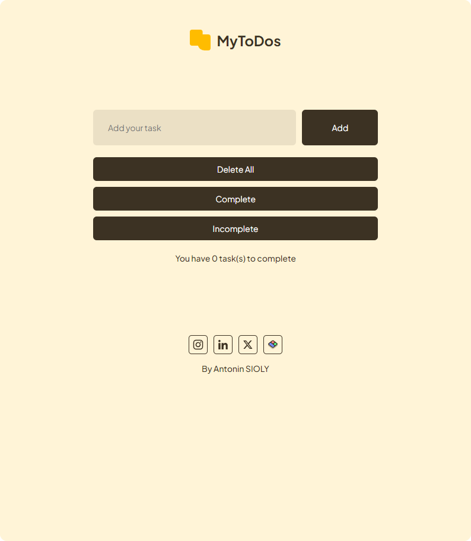

# MyToDos


## Overview
**MyToDos** is a simple and user-friendly to-do list application built with HTML, CSS, and JavaScript. The goal of this project is to provide a practical and interactive way to manage tasks, while also serving as a learning project for mastering web development fundamentals.

## Features
* **Add Tasks:** Easily add personalized tasks with a single click or by pressing the "Enter" key.

* **Task Management:** Mark tasks as complete, and delete them individually or all at once.

* **Filters:** Filter tasks by their completion status (complete/incomplete).

* **Responsive Design:** Optimized for various screen sizes with smooth user interactions.

* **Local Storage:** Automatically saves your tasks, so they remain even after refreshing the page.

## Demo
Check out the live demo: [MyToDos Live](https://heyanto.github.io/MyToDos-App/)

## Installation
1. Clone the repository:
```bash
git clone https://github.com/yourusername/MyToDos.git
```
2. Navigate to the project directory:
```bash
cd MyToDos
```
3. Open "index.html" in your favorite web browser.

## Technologies Used
* **HTML5:** Structure of the web pages.
* **CSS3:** Styling, animations, and responsive design.
* **JavaScript:** Interactivity and task management logic.

## Learning Objectives
This project was created as part of my journey to become a web developer. By building MyToDos, I aimed to:

* Enhance my understanding of HTML, CSS, and JavaScript.
* Practice DOM manipulation and event handling in JavaScript.
* Implement responsive design principles.
* Explore browser storage with local storage.

I'm preparing to enter a formal web development training program in early 2025, and this project is a key step in my preparation.

## Future Improvements
* Drag and Drop: Implement drag-and-drop functionality for reordering tasks.
* Custom Themes: Allow users to choose different color themes.
* User Authentication: Add user login to save tasks across devices.

## Contributing
If you would like to contribute to this project, please feel free to fork the repository and submit a pull request. Any feedback or suggestions are also welcome!